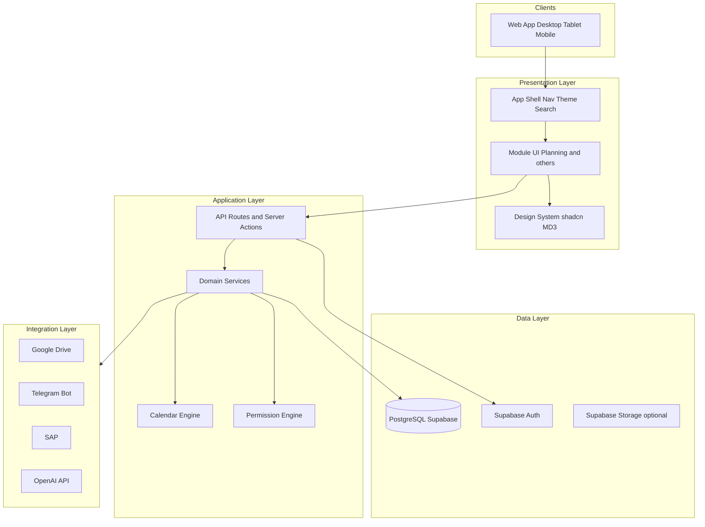
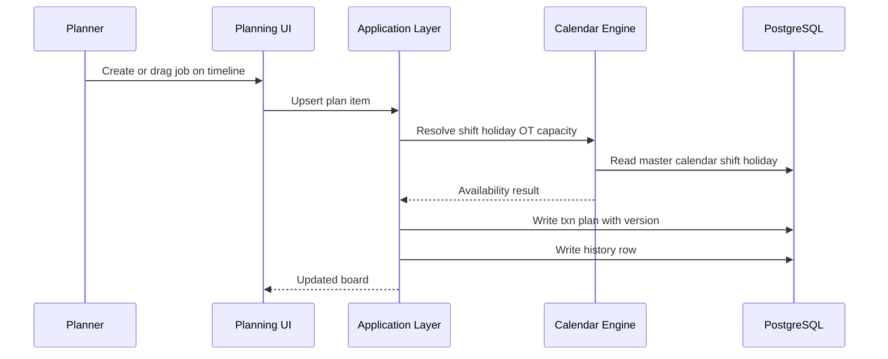

# 02 — System Architecture

**Product:** Smart-Factory Manufacturing Platform  
**Style:** Layered modular platform on Next.js + Supabase

---

## 1. Architecture Principles

1. **Modular monolith first** — one deployable Next.js app with clear module boundaries; extract services only when justified.
2. **Database as system of record** — PostgreSQL (Supabase) holds masters, transactions, history, logs, config, integration state, and dashboard layouts.
3. **Shared engines** — Calendar, Authorization, Audit/History, Notification, File metadata.
4. **Integration bus** — external systems enter through Integration domain adapters.
5. **UI shell + feature modules** — Google Workspace–style shell hosts module routes.

---

## 2. Logical Layers

---

## 3. Database Domain Separation

| Domain | Schema / Prefix | Responsibility |
|--------|-----------------|----------------|
| Master | `master` | Reference data (users, roles, machines, lines, …) |
| Transaction | `txn` | Operational documents (plans, orders, releases) |
| History | `history` | Immutable change snapshots |
| Log | `log` | Application, security, integration logs |
| Configuration | `config` | Feature flags, UI prefs schema, system settings |
| Integration | `integration` | External sync jobs, mappings, payloads |
| Dashboard | `dashboard` | Widget layouts, saved views |

See [04_DATABASE_STANDARD.md](04_DATABASE_STANDARD.md).

---

## 4. Module Boundaries

| Module | Owns (UI + domain services) | Shares |
|--------|----------------------------|--------|
| Planning | Plan boards, capacity checks, release workflow | Calendar, Masters, Authz |
| Production | Execution, job status | Calendar, Plans, Masters |
| Store | Inventory movements | Masters, Calendar |
| OEE | Metrics calculation / display | Calendar, Machines, Production |
| Quality | Inspections, NCR | Masters, Production |
| Maintenance | Work orders, shutdown windows | Calendar, Machines |
| Dashboard | Aggregations, widgets | All read models |
| Integrations | Drive, Telegram, SAP, AI | Integration schema |

Modules must not write directly to another module’s transaction tables except through published domain services or documented status transitions.

---

## 5. Shared Engines

### 5.1 Calendar Engine

Single engine for Working Day, Holiday, Shift, OT, Machine Shutdown, Maintenance, Capacity windows, Timeline, Resource views.  
Details: [18_CALENDAR_ENGINE.md](18_CALENDAR_ENGINE.md).

### 5.2 Permission Engine

RBAC evaluation from Master Roles / Permissions.  
Details: [15_PERMISSION_STANDARD.md](15_PERMISSION_STANDARD.md).

### 5.3 Audit / History Engine

Soft delete, version bump, history row on significant mutations.  
Details: [16_HISTORY_STANDARD.md](16_HISTORY_STANDARD.md).

### 5.4 Notification Engine

Template-driven Telegram (and future channels).  
Details: [20_TELEGRAM_STANDARD.md](20_TELEGRAM_STANDARD.md).

---

## 6. Runtime Topology

| Component | Host | Role |
|-----------|------|------|
| Next.js App | Vercel | UI + API + Server Actions |
| PostgreSQL + Auth | Supabase | Data + identity |
| GitHub | Source control + CI |
| Google Drive | External docs |
| Telegram | Alerts / bots |
| OpenAI | AI Assistant (future) |

---

## 7. Data Flow — Planning Happy Path

---

## 8. Expansion Without Architecture Rewrite

New modules MUST:

1. Reuse existing schemas and audit columns.
2. Add tables only in the correct domain.
3. Consume Calendar Engine for time/capacity.
4. Register permissions in Master Permissions.
5. Expose APIs under the API standard ([08_API_STANDARD.md](08_API_STANDARD.md)).

---

## Related Documents

- [03_TECH_STACK.md](03_TECH_STACK.md)
- [07_MODULES.md](07_MODULES.md)
- [13_FOLDER_STRUCTURE.md](13_FOLDER_STRUCTURE.md)
- [21_DEPLOYMENT_STANDARD.md](21_DEPLOYMENT_STANDARD.md)
