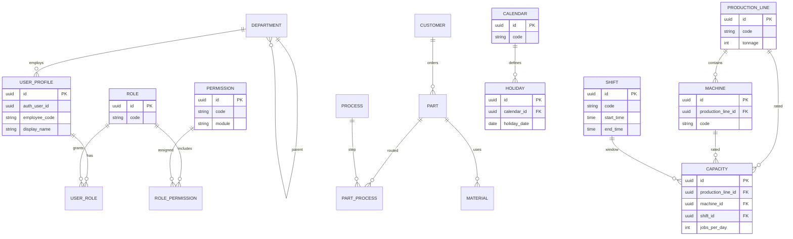
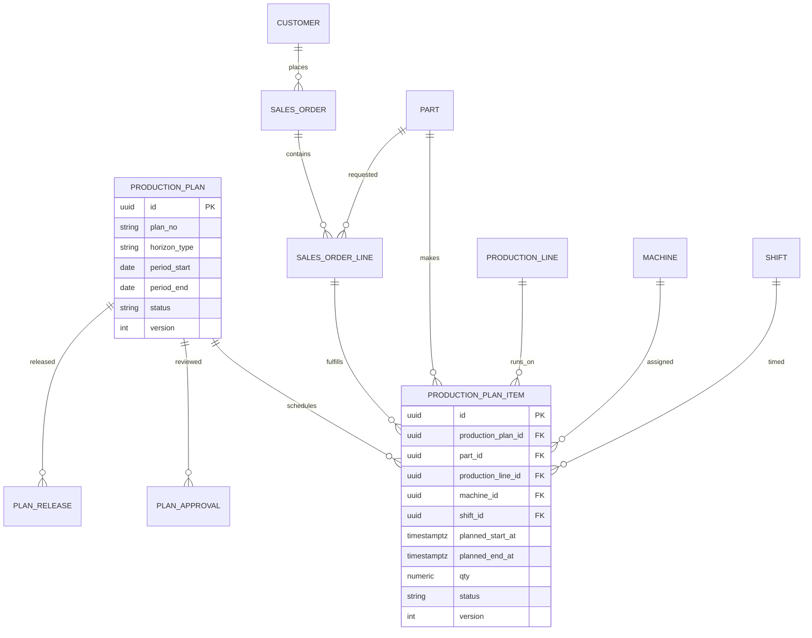

# 06 — ER Diagram

**Product:** Smart-Factory Manufacturing Platform  
**Scope:** Masters, Calendar, Authz, Planning transactions

---

## 1. Core Master & Authz

---

## 2. Planning Transactions

---

## 3. History / Config / Dashboard (logical)

---

## 4. Notes

1. All business entities include Audit\* columns (omitted in diagrams for clarity).
2. Soft delete: relationships remain; queries filter `deleted_at IS NULL`.
3. Calendar Engine reads `calendar`, `holiday`, `shift`, `capacity`, plus future shutdown/maintenance transactions — see [18_CALENDAR_ENGINE.md](18_CALENDAR_ENGINE.md).
4. Full column lists: [05_DATABASE_DICTIONARY.md](05_DATABASE_DICTIONARY.md).

---

## Related Documents

- [04_DATABASE_STANDARD.md](04_DATABASE_STANDARD.md)
- [05_DATABASE_DICTIONARY.md](05_DATABASE_DICTIONARY.md)
- [26_MASTER_DATA.md](26_MASTER_DATA.md)
