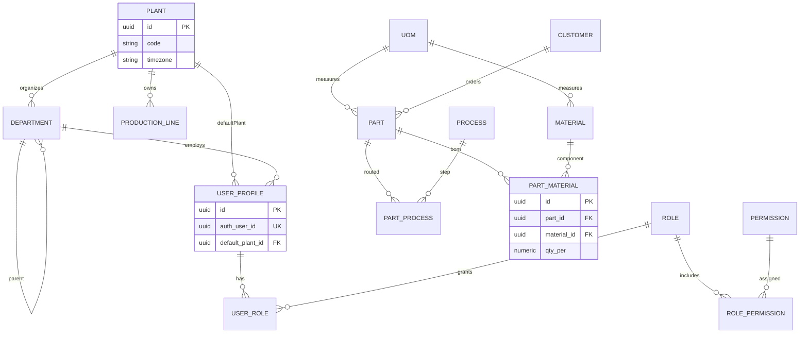
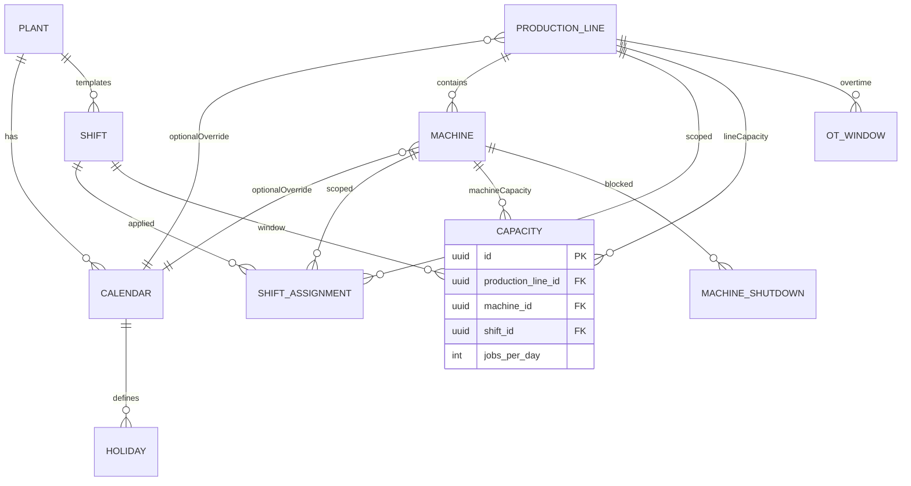
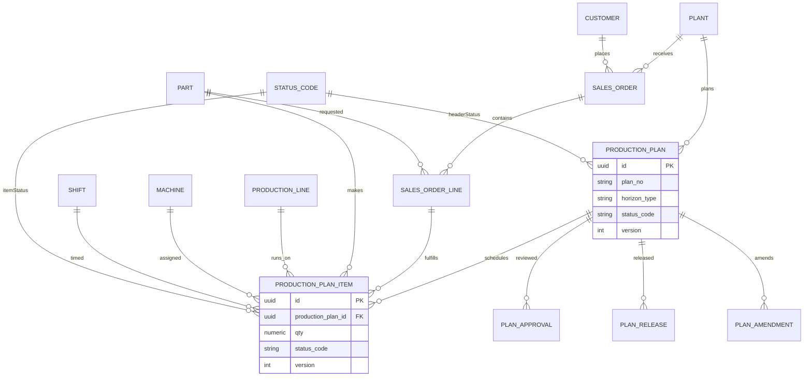
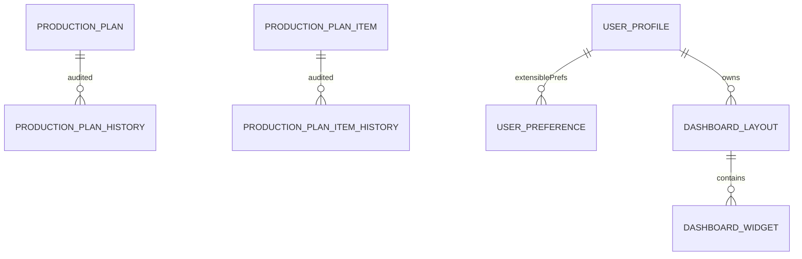

# 06 — ER Diagram

**Product:** Smart-Factory Manufacturing Platform  
**Scope:** Plant, masters, calendar, authz, BOM, planning  
**Columns:** Audit\* omitted for clarity — see [04](04_DATABASE_STANDARD.md) / [05](05_DATABASE_DICTIONARY.md)

---

## 1. Organization, Authz, Product

---

## 2. Calendar, Line, Capacity

**Capacity rule:** exactly one of `production_line_id` or `machine_id` is set (XOR).

**Calendar resolution:** machine.calendar_id → line.calendar_id → plant.default_calendar_id.

---

## 3. Planning Transactions

---

## 4. History / Prefs / Dashboard

---

## 5. Notes

1. Soft delete: FKs remain; queries filter `deleted_at IS NULL`.
2. BOM is `part_material` — **not** a direct Part→Material one-to-many ownership edge.
3. Calendar Engine inputs: holiday, shift_assignment, capacity, `ot_window`, `machine_shutdown`, maintenance (future).
4. Column authority: [05_DATABASE_DICTIONARY.md](05_DATABASE_DICTIONARY.md).

---

## Related Documents

- [04_DATABASE_STANDARD.md](04_DATABASE_STANDARD.md)
- [05_DATABASE_DICTIONARY.md](05_DATABASE_DICTIONARY.md)
- [18_CALENDAR_ENGINE.md](18_CALENDAR_ENGINE.md)
- [33_PLANT_ORG_STANDARD.md](33_PLANT_ORG_STANDARD.md)
