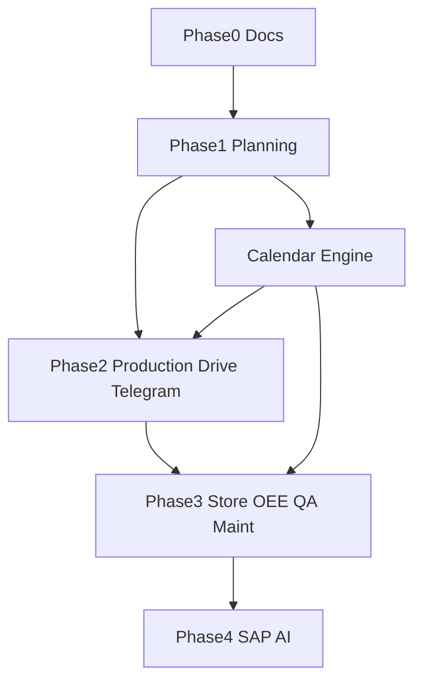

# 24 — Roadmap

**Product:** Smart-Factory Manufacturing Platform

---

## Phase 0 — Documentation Foundation

- `/docs` standards `00`–`36` (including review remediation)
- Decision log through ADR-011
- No application code yet

---

## Phase 1 — Production Planning MVP

1. Supabase schemas + masters seed (plant `SF1`, lines 110T–3200T, shifts, calendar, UoM, status codes)
2. Auth + RBAC helpers + plant-scoped RLS
3. App shell (sidebar, top nav, theme)
4. Calendar Engine v1 (assignment resolution, holiday, shift, OT, shutdown, capacity)
5. Plan board: daily / weekly / monthly + drag-drop + resource view
6. Submit / approve / reject / release + outbox events
7. History + logging + idempotency keys

---

## Phase 2 — Execution & Collaboration

- Production module (consume releases)
- Google Drive attachments
- Telegram notifications
- Dashboard layouts v1

---

## Phase 3 — Operations Excellence

- Store / Warehouse
- OEE
- Quality
- Maintenance (feeds calendar shutdowns)

---

## Phase 4 — Enterprise Integration & AI

- SAP integration
- AI Assistant (OpenAI)
- Advanced capacity optimization aids

---

## Dependencies

---

## Exit Criteria — Phase 1

- Planners schedule all six lines without hardcoded line lists
- Conflicts with holiday/OT/capacity visible
- Approvals audited
- Docs remain accurate

---

## Related Documents

- [01_PROJECT_VISION.md](01_PROJECT_VISION.md)
- [07_MODULES.md](../20-architecture/07_MODULES.md)
- [29_DECISION_LOG.md](../99-changelog/29_DECISION_LOG.md)
