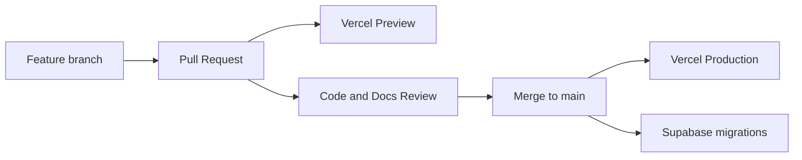

# 21 — Deployment Standard

**Product:** Smart-Factory Manufacturing Platform

---

## 1. Topology

| Component | Platform |
|-----------|----------|
| Web app | Vercel |
| Database + Auth | Supabase |
| Source / CI | GitHub |
| Secrets | Vercel Env + Supabase secrets |

---

## 2. Environments

| Name | Git | Vercel | Supabase |
|------|-----|--------|----------|
| Local | feature branch | `vercel dev` / `next dev` | local or linked |
| Preview | PR branches | Preview deployment | Non-production project |
| Production | `main` | Production | Production project |

Never point Preview at Production database.

---

## 3. Release Flow

1. Docs and schema updates travel with the PR.
2. Apply migrations in order; verify with dictionary.
3. Promote app only when migrations are compatible.

---

## 4. Required Env Vars (categories)

| Category | Examples |
|----------|----------|
| Supabase | URL, anon/publishable key, service role (server) |
| App | `NEXT_PUBLIC_APP_URL` |
| Google Drive | Client/service credentials |
| Telegram | Bot token |
| OpenAI | API key |

Exact names documented when app scaffolding begins. No secrets in git.

---

## 5. CI Expectations

- Typecheck / lint / unit tests on PR
- Migration validation when SQL changes
- Block merge on failing checks

---

## 6. Rollback

- App: Vercel instant rollback to prior deployment
- DB: forward-fix migrations preferred; destructive down migrations discouraged
- Feature flags to disable risky modules quickly

---

## Related Documents

- [03_TECH_STACK.md](03_TECH_STACK.md)
- [14_SECURITY_STANDARD.md](14_SECURITY_STANDARD.md)
- [22_TESTING_STANDARD.md](22_TESTING_STANDARD.md)
