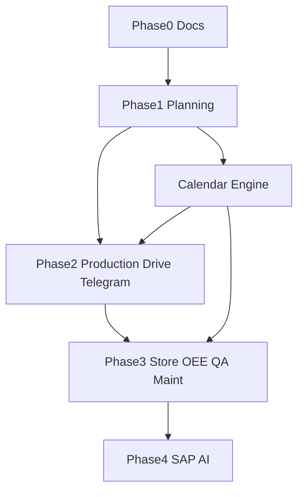

# 24 — Roadmap

**Product:** Smart-Factory Manufacturing Platform

---

## Phase 0 — Documentation Foundation (current)

- Complete `/docs` standards (this set)
- Decision log bootstrap
- No application code yet

---

## Phase 1 — Production Planning MVP

1. Supabase project + schemas + masters seed (lines 110T–3200T, shifts, calendar)
2. Auth + RBAC baseline
3. App shell (sidebar, top nav, theme)
4. Calendar Engine v1 (working day, holiday, shift, capacity)
5. Plan board: daily / weekly / monthly
6. Drag-and-drop scheduling + resource view
7. Submit / approve / reject / release
8. History + basic logging

---

## Phase 2 — Execution & Collaboration

- Production module (consume releases)
- Google Drive attachments
- Telegram notifications
- Dashboard layouts v1

---

## Phase 3 — Operations Excellence

- Store / Warehouse
- OEE
- Quality
- Maintenance (feeds calendar shutdowns)

---

## Phase 4 — Enterprise Integration & AI

- SAP integration
- AI Assistant (OpenAI)
- Advanced capacity optimization aids

---

## Dependencies

---

## Exit Criteria — Phase 1

- Planners schedule all six lines without hardcoded line lists
- Conflicts with holiday/OT/capacity visible
- Approvals audited
- Docs remain accurate

---

## Related Documents

- [01_PROJECT_VISION.md](01_PROJECT_VISION.md)
- [07_MODULES.md](07_MODULES.md)
- [29_DECISION_LOG.md](29_DECISION_LOG.md)
