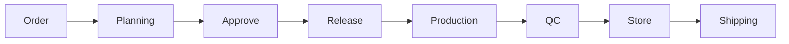
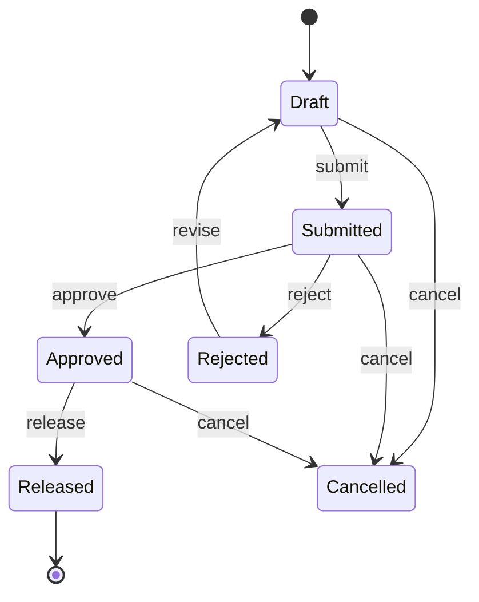

# 27 — Business Flow

**Product:** Smart-Factory Manufacturing Platform

---

## 1. End-to-End Manufacturing Flow

```text
Order → Planning → Approve → Release → Production → QC → Store → Shipping
```



Phase 1 implements through **Release**. Downstream stages are specified for architecture continuity.

---

## 2. Stage Definitions

| Stage | Owner module | Description |
|-------|--------------|-------------|
| Order | Planning (stub) / SAP later | Customer demand enters as sales order + lines |
| Planning | Planning | Schedule jobs onto lines/machines/shifts |
| Approve | Planning | Supervisor validates capacity and priorities |
| Release | Planning | Frozen plan handed to Production |
| Production | Production | Execute jobs, report progress |
| QC | Quality | Inspect; pass/fail/NCR |
| Store | Store | Put-away FG / issue materials |
| Shipping | Store / SAP | Dispatch to customer |

---

## 3. Planning Detail Flow



### Rules

1. Only `draft` / `rejected` freely editable (policy may allow limited approved edits pre-release).
2. `released` items are immutable in Planning except via controlled amendment process (future ADR).
3. Calendar Engine validates working time and capacity on submit and release.
4. Each transition writes history + optional Telegram event.

---

## 4. Actors

| Actor | Typical actions |
|-------|-----------------|
| Planner | Create/edit plans, drag-drop, submit |
| Supervisor | Approve/reject/release |
| Admin | Masters, calendars, capacities |
| Viewer | Read boards |
| Operator | Future production confirmations |

---

## 5. Exception Paths

| Situation | Handling |
|-----------|----------|
| Capacity overflow | Warn/block per `config`; reason code required to override if allowed |
| Holiday collision | Block or force OT request |
| Machine shutdown | Auto-exclude resource windows |
| Order change after plan | Amend plan item; re-approve if status requires |

---

## Related Documents

- [01_PROJECT_VISION.md](01_PROJECT_VISION.md)
- [07_MODULES.md](07_MODULES.md)
- [28_SCREEN_FLOW.md](28_SCREEN_FLOW.md)
- [18_CALENDAR_ENGINE.md](18_CALENDAR_ENGINE.md)
