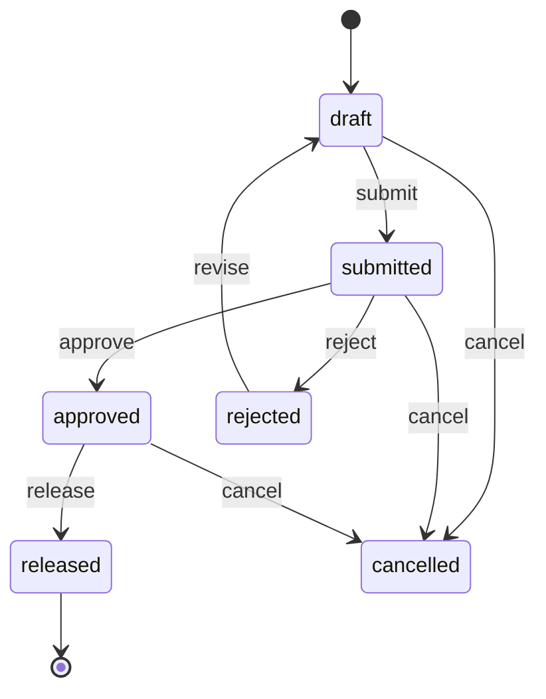

# 32 — Status & State Machine Standard

**Product:** Smart-Factory Manufacturing Platform

---

## 1. Purpose

All workflow statuses are **config-driven codes** in `master.status_code`, not free-form strings or Postgres ENUMs. Transition rules are documented here and enforced in domain services.

---

## 2. Status Lookup

`master.status_code`:

| Column | Meaning |
|--------|---------|
| `entity_type` | e.g. `production_plan`, `production_plan_item`, `sales_order` |
| `code` | Stable code |
| `name` | Display |
| `sort_order` | UI order |
| `is_terminal` | No further transitions |

Unique `(entity_type, code)` where active.

---

## 3. Production Plan (header)

Codes: `draft`, `submitted`, `approved`, `rejected`, `released`, `cancelled`.

Permissions: [15_PERMISSION_STANDARD.md](../00-governance/15_PERMISSION_STANDARD.md).  
Business narrative: [27_BUSINESS_FLOW.md](../10-business/27_BUSINESS_FLOW.md).

---

## 4. Production Plan Item

Recommended codes: `planned`, `locked`, `released`, `cancelled`, `amended`.

| Header status | Item editability |
|---------------|------------------|
| `draft` / `rejected` | Editable |
| `submitted` | Read-only (or limited) |
| `approved` | Read-only unless config allows pre-release tweak |
| `released` | Immutable except via `txn.plan_amendment` |

Item `status_code` must stay consistent with header policy (domain service validates).

---

## 5. Sales Order (stub)

Codes: `open`, `partial`, `planned`, `closed`, `cancelled`.  
`qty_allocated` on lines drives `partial` vs `planned`.

---

## 6. Transition Enforcement

1. API actions (`submit`, `approve`, …) — not arbitrary PATCH of `status_code`.
2. Each transition writes history + optional outbox event ([34](../20-architecture/34_DOMAIN_EVENTS.md)).
3. Invalid transition → `422` with stable error code.

---

## 7. Post-Release Amendment

Released plans are not silently edited. Use `txn.plan_amendment` (ADR-009). Until implemented, UI/API must reject direct edits to released items.

---

## Related Documents

- [05_DATABASE_DICTIONARY.md](05_DATABASE_DICTIONARY.md)
- [27_BUSINESS_FLOW.md](../10-business/27_BUSINESS_FLOW.md)
- [08_API_STANDARD.md](../50-development/08_API_STANDARD.md)
