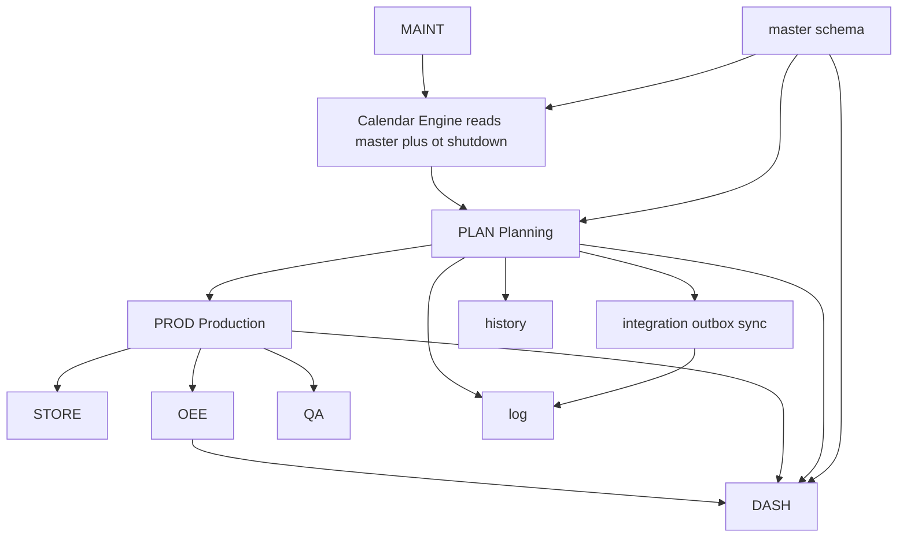

# 41 — Module Relationships

**Product:** Smart-Factory Manufacturing Platform  
**Part of:** [40_DATABASE_ARCHITECTURE.md](40_DATABASE_ARCHITECTURE.md)  
**No SQL yet.**

---

## 1. Module catalog ↔ data ownership

| Module | Code | Primary schemas | Reads | Writes |
|--------|------|-----------------|-------|--------|
| Platform / Authz | — | `master` (users, roles), `authz` | — | profiles, roles |
| Production Planning | `PLAN` | `txn` (plans, orders stub, OT, shutdown) | `master`, calendar | `txn`, `history`, `integration.outbox` |
| Production | `PROD` | `txn.production_job*` (future) | released plans, masters | jobs, events, outbox |
| Store | `STORE` | `txn.stock_*` (future) | parts/materials | movements, balances |
| OEE | `OEE` | `txn.oee_sample`, `downtime_event` (future) | machines, calendar, production | samples |
| Quality | `QA` | `txn.inspection`, `ncr` (future) | production | inspections |
| Maintenance | `MAINT` | `txn.maintenance_order` (future) | machines | orders → calendar inputs |
| Dashboard | `DASH` | `dashboard` | read models / aggregates | layouts, widgets |
| Google Drive | `GDRIVE` | `integration.file_link` | masters | file_link, sync |
| Telegram | `TG` | `integration` + templates | outbox | delivery logs |
| SAP | `SAP` | `integration.sync_*`, `id_map` | masters/txns | sync jobs |
| AI Assistant | `AI` | (no dedicated tables Phase 1) | permitted reads | `log` / outbox only |

---

## 2. Module dependency graph

---

## 3. Shared engines (not modules, but cross-cutting)

| Engine | Data inputs | Used by |
|--------|-------------|---------|
| Calendar Engine | `calendar`, `holiday`, `shift`, `shift_assignment`, `capacity`, `ot_window`, `machine_shutdown`, future maintenance | PLAN, PROD, STORE, OEE, DASH, MAINT |
| Permission Engine | `user_profile`, `role`, `permission`, junctions | All |
| Audit / History | pattern H tables | PLAN (+ others as they mutate) |
| Outbox | `integration.outbox` | PLAN events → TG, projections, SAP later |

---

## 4. Rules

1. Modules must not create private copies of masters (no duplicate line/machine tables).  
2. Modules write only their owned `txn` tables (+ history/outbox as required).  
3. Cross-module status handoffs use documented transitions ([32](32_STATUS_STATE_MACHINE.md)) and events ([34](../20-architecture/34_DOMAIN_EVENTS.md)).  
4. Calendar time semantics always via Calendar Engine — never forked per module.

---

## 5. Phase 1 boundary

**In scope tables:** all `master.*` needed for planning, `txn` planning + OT/shutdown, `history` plan tables, `log`, `config`, `integration` (outbox/idempotency/file_link stubs), `dashboard` layout stubs.

**Reserved names only (no Phase 1 columns forced into production use):** Production/Store/OEE/QA/Maintenance job tables — listed in [44_TRANSACTION_LIST.md](44_TRANSACTION_LIST.md) § Future.

---

## Related Documents

- [07_MODULES.md](../20-architecture/07_MODULES.md)
- [42_ENTITY_RELATIONSHIPS.md](42_ENTITY_RELATIONSHIPS.md)
- [40_DATABASE_ARCHITECTURE.md](40_DATABASE_ARCHITECTURE.md)
