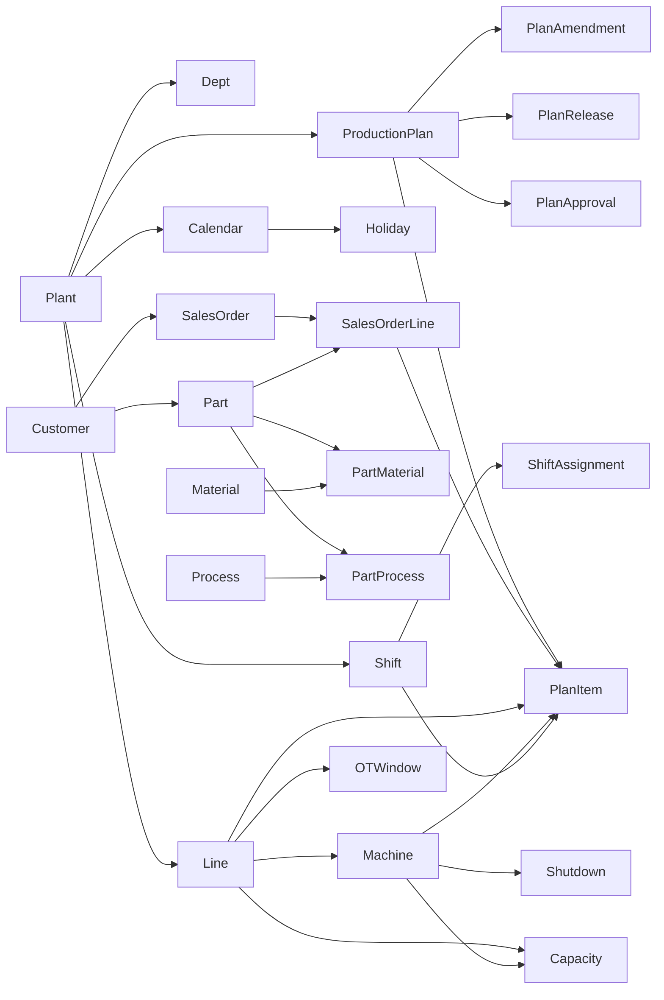

# 42 — Entity Relationships

**Product:** Smart-Factory Manufacturing Platform  
**Part of:** [40_DATABASE_ARCHITECTURE.md](40_DATABASE_ARCHITECTURE.md)  
**Diagrams also:** [06_ER_DIAGRAM.md](06_ER_DIAGRAM.md) · Matrix: [37_TABLE_RELATIONSHIPS.md](37_TABLE_RELATIONSHIPS.md)  
**No SQL yet.**

---

## 1. Core entity map

---

## 2. Relationship domains

### 2.1 Organization

| From | To | Type | Notes |
|------|----|------|-------|
| Plant | Department | 1:N | Tree via `parent_id` |
| Plant | UserProfile | 0..1:N | `default_plant_id` |
| UserProfile | UserRole | 1:N | |
| Role | Permission | N:M | `role_permission` |

### 2.2 Product

| From | To | Type | Notes |
|------|----|------|-------|
| Part | Material | N:M | `part_material` BOM |
| Part | Process | N:M | `part_process` routing |
| Part / Material | UoM | N:1 | required |

### 2.3 Resources & calendar

| From | To | Type | Notes |
|------|----|------|-------|
| Line | Machine | 1:N | |
| Line/Machine | Calendar | N:0..1 | else plant default |
| Calendar | Holiday | 1:N | |
| Shift | ShiftAssignment | 1:N | scoped plant/line/machine |
| Line XOR Machine | Capacity | 1:N | CHECK XOR |
| Line/Machine | OT / Shutdown | 1:N | txn inputs |

### 2.4 Planning

| From | To | Type | Notes |
|------|----|------|-------|
| SalesOrder | SalesOrderLine | 1:N | |
| ProductionPlan | ProductionPlanItem | 1:N | |
| SalesOrderLine | PlanItem | 0..1:N | partial allocate |
| Plan | Approval / Release / Amendment | 1:N | |

### 2.5 Support

| From | To | Type | Notes |
|------|----|------|-------|
| Plan / PlanItem | History | 1:N | append-only |
| Connection | SyncJob | 1:N | |
| Layout | Widget | 1:N | CASCADE |

---

## 3. Cardinality highlights

- One plant seeds Phase 1 (`SF1`); design allows many.  
- One plan has many items (~20–30 jobs/line/day × lines × horizon).  
- Status is logical to `status_code` lookup (by `entity_type` + `code`), not always a physical FK.  
- Polymorphic attachments: `file_link.entity_type` + `entity_id`.

---

## 4. Integrity rules (entity-level)

1. Capacity: exactly one of `production_line_id` | `machine_id`.  
2. Plan item: `planned_end_at` > `planned_start_at`.  
3. Calendar resolution: machine → line → `plant.default_calendar_id`.  
4. Released plan items change only via amendment entity.  
5. Actor FKs always `user_profile`, never raw `auth.users` (except `auth_user_id` on profile).

---

## Related Documents

- [06_ER_DIAGRAM.md](06_ER_DIAGRAM.md)
- [37_TABLE_RELATIONSHIPS.md](37_TABLE_RELATIONSHIPS.md)
- [38_FOREIGN_KEYS.md](38_FOREIGN_KEYS.md)
- [43_MASTER_DATA_LIST.md](43_MASTER_DATA_LIST.md)
- [44_TRANSACTION_LIST.md](44_TRANSACTION_LIST.md)
