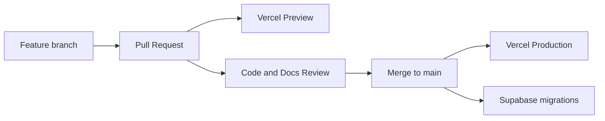

# 21 — Deployment Standard

**Product:** Smart-Factory Manufacturing Platform

---

## 1. Topology

| Component | Platform |
|-----------|----------|
| Web app | Vercel |
| Database + Auth | Supabase |
| Source / CI | GitHub |
| Secrets | Vercel Env + Supabase secrets |

---

## 2. Environments

| Name | Git | Vercel | Supabase |
|------|-----|--------|----------|
| Local | feature branch | `vercel dev` / `next dev` | local or linked |
| Preview | PR branches | Preview deployment | Non-production project |
| Production | `main` | Production | Production project |

Never point Preview at Production database.

---

## 3. Release Flow

1. Docs and schema updates travel with the PR.
2. Apply migrations in order; verify with dictionary.
3. Promote app only when migrations are compatible.

---

## 4. Environment Variables (canonical names)

| Variable | Scope | Purpose |
|----------|-------|---------|
| `NEXT_PUBLIC_SUPABASE_URL` | Public | Supabase API URL |
| `NEXT_PUBLIC_SUPABASE_ANON_KEY` | Public | Publishable / anon key |
| `SUPABASE_SERVICE_ROLE_KEY` | Server only | Privileged server operations |
| `NEXT_PUBLIC_APP_URL` | Public | Canonical app URL |
| `GOOGLE_DRIVE_CLIENT_EMAIL` / `GOOGLE_DRIVE_PRIVATE_KEY` | Server | Drive service account (or OAuth secrets as chosen) |
| `TELEGRAM_BOT_TOKEN` | Server | Bot API |
| `OPENAI_API_KEY` | Server | AI Assistant |

No secrets in git. Preview must not use Production Supabase.

---

## 5. Backup & Disaster Recovery

| Concern | Standard |
|---------|----------|
| Database | Enable Supabase automated backups on Production; document RPO target (default ≤ 24h until stricter ADR) |
| Restore drill | Perform restore test at least when major schema phases complete |
| App | Vercel rollback to prior deployment |
| Secrets | Recreatable from password manager / Vercel env — not only from DB |
| Point-in-time | Prefer PITR when project tier allows; note in runbook |

---

## 6. CI Expectations

- Typecheck / lint / unit tests on PR
- Migration validation when SQL changes
- Block merge on failing checks

---

## 7. Rollback

- App: Vercel instant rollback
- DB: forward-fix migrations preferred; destructive downs discouraged
- Feature flags to disable risky modules quickly
- Deploy order: migrate DB (compatible) → deploy app; reverse on rollback only when app is backward-compatible with DB

---

## Related Documents

- [03_TECH_STACK.md](../20-architecture/03_TECH_STACK.md)
- [14_SECURITY_STANDARD.md](../00-governance/14_SECURITY_STANDARD.md)
- [22_TESTING_STANDARD.md](../50-development/22_TESTING_STANDARD.md)
