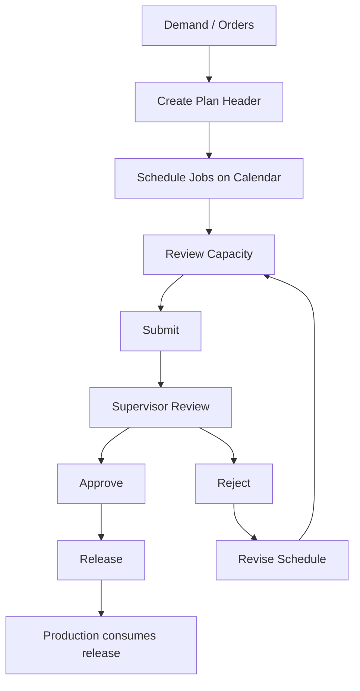

# Production Planning — Business Analysis

**Product:** Smart-Factory Manufacturing Platform  
**Module:** Production Planning (Phase 1 through Release)  
**Status:** Draft for review — **do not treat as database design**  
**Sources:** All documents under `knowledge/` (+ Calendar Engine narrative in legacy archive)  
**Related:** [BUSINESS_FLOW.md](BUSINESS_FLOW.md) · [BUSINESS_RULES.md](BUSINESS_RULES.md) · [REQUIREMENTS.md](REQUIREMENTS.md) · [TERMINOLOGY.md](TERMINOLOGY.md) · [../60_Module/PLANNING.md](../60_Module/PLANNING.md) · [../99_ADR/ADR-003-Calendar.md](../99_ADR/ADR-003-Calendar.md)

---

## 0. Purpose of this document

Explain **how Production Planning works as a business process** before any further schema or UI change discussion.

Out of scope here:

- Table/column design  
- Migration files  
- API contracts  
- Screen wireframes beyond business intent  

---

## 1. Business context

The factory runs **six press / forming lines** (110T–3200T class). Each line typically handles on the order of **20–30 jobs per day**. Planners today risk using spreadsheets that ignore holidays, overtime, machine downtime, and shared capacity rules.

Production Planning is the Phase 1 module that:

1. Takes customer **demand (orders)**  
2. Schedules **jobs** onto lines / machines / shifts over a day / week / month horizon  
3. Makes **capacity and calendar constraints visible**  
4. Runs **approval** then **release** to Production  

Downstream (Production → QC → Store → Shipping) is defined for continuity but **not executed** in this module’s Phase 1 scope.

End-to-end chain:

```text
Order → Planning → Approve → Release → Production → QC → Store → Shipping
                 └──────── Phase 1 boundary ────────┘
```

---

## 2. Actors

| Actor | Business role | Primary goals in Planning |
|-------|---------------|---------------------------|
| **Planner** | Builds and adjusts the schedule | Create plans, place/move jobs, balance load, submit for approval |
| **Supervisor** | Owns plan quality and release | Review capacity/priority, approve or reject, release to Production |
| **Admin** | Owns masters and plant config | Maintain lines, machines, shifts, calendars, holidays, capacities, roles |
| **Viewer** | Read-only stakeholder | Inspect boards and statuses without changing the plan |
| **Operator** | Shop-floor (future) | Consumes **released** work — not a Planning editor in Phase 1 |
| **Customer / Sales** (indirect) | Demand source | Provide orders; may trigger replanning when demand changes |
| **System / Calendar Engine** (logical actor) | Shared time & capacity truth | Resolve working days, shifts, OT, shutdowns, capacity fit |

**RBAC intent (business, not schema):**

| Action family | Typical actor |
|---------------|---------------|
| Read plans / boards | Planner, Supervisor, Viewer, Admin |
| Create / update / drag-drop / submit | Planner (+ Admin) |
| Approve / reject | Supervisor (+ Admin) |
| Release | Supervisor (+ Admin) |
| Maintain calendar masters | Admin |

---

## 3. Business goals

### 3.1 Primary goals

1. **Schedulability** — All six lines can be planned without hardcoding line lists in the process or UI.  
2. **Constraint visibility** — Capacity, machine, shift, holiday, OT, and shutdown effects are visible **before** release.  
3. **Controlled change** — Plans move through a clear approval path; released work is not silently rewritten.  
4. **Auditability** — Who submitted, approved, rejected, released, and major schedule moves are attributable.  
5. **Shared calendar truth** — Planning uses the same Calendar Engine rules as future Production / Store / OEE / Maintenance.  
6. **Plant readiness** — Process works in a plant/site context from day one (multi-site later without reinventing Planning).

### 3.2 Success criteria (business)

| # | Criterion |
|---|-----------|
| 1 | Planners schedule day/week/month horizons across all lines |
| 2 | Overload vs nominal capacity is visible on a capacity view |
| 3 | Holiday / OT / shutdown awareness influences “can we place this job?” |
| 4 | Supervisor can approve/reject with comments; release freezes intent for Production |
| 5 | Drag-and-drop reschedule is intentional and conflict-aware, not a silent overwrite war |

### 3.3 Non-goals (Planning phase)

| Non-goal | Why |
|----------|-----|
| Full MES / job confirmation UI | Belongs to Production module |
| Payroll OT money calculation | Calendar OT is availability, not payroll |
| PLC / live machine telemetry | Future OEE |
| AI auto-scheduling as primary planner | Roadmap later; human planner remains accountable |
| Silent edit of released plans | Must use amendment path |
| Replacing SAP as system of record for finance | Integration later |

---

## 4. Inputs

Business inputs the Planning process consumes:

### 4.1 Demand inputs

| Input | Meaning |
|-------|---------|
| Sales / customer order | What the customer wants (header) |
| Order lines | Part, quantity ordered, due date, how much already allocated to plans |
| Part master | What can be scheduled (identity, customer link, unit of measure) |
| Customer master | Who the demand belongs to |

### 4.2 Resource inputs

| Input | Meaning |
|-------|---------|
| Plant | Site, timezone, default calendar |
| Production lines | Schedulable lanes (e.g. 110T…3200T) |
| Machines | Resources on a line (optional finer lane) |
| Shifts | Civil start/end, breaks, midnight-crossing |
| Shift assignments | Which shift applies to plant / line / machine and which weekdays, over an effective date range |
| Capacity definitions | Nominal jobs/day and/or hours per shift for a line **or** a machine (not both at once) |

### 4.3 Calendar / availability inputs

| Input | Meaning |
|-------|---------|
| Calendar | Named working calendar + timezone |
| Holidays | Non-working (or special) civil dates on a calendar |
| OT windows | Approved overtime intervals that **extend** availability |
| Machine shutdowns | Unavailability blocks (breakdown, PM, etc.) |
| Maintenance windows (future) | Additional unavailability feed into the same engine |

### 4.4 Planning session inputs

| Input | Meaning |
|-------|---------|
| Horizon type | Daily / weekly / monthly |
| Period start / end | Civil date range of the plan |
| Planner intent | Title, remarks, priorities (business narrative) |
| Existing plan items | Current schedule to adjust |

### 4.5 Authorization inputs

| Input | Meaning |
|-------|---------|
| Authenticated user | Who is acting |
| Roles / permissions | What they may do |
| Plant membership | Which site’s plans they may see/change |

---

## 5. Outputs

| Output | Consumer | Meaning |
|--------|----------|---------|
| **Production plan (header)** | Supervisors, auditors | Named schedule document for a horizon/period/status |
| **Plan items (jobs)** | Calendar board, capacity, Production (after release) | Scheduled work: part, qty, line/machine/shift, start/end |
| **Capacity load picture** | Planner, Supervisor | Jobs/hours scheduled vs nominal capacity by line and day |
| **Approval trail** | Compliance, Supervisor | Submit / approve / reject events with actor, time, comment |
| **Release record** | Production module | “This plan is handed off” with effective time |
| **Allocation signal on order lines** | Demand control | How much ordered qty is already planned (`partial` / `planned` narrative) |
| **History of meaningful changes** | Audit | Status transitions and schedule moves are reconstructable |
| **Notifications (future)** | Telegram / inbox | Plan submitted / approved / rejected / released / conflict alerts via templates |
| **Domain events (future outbox)** | Integrations, dashboards | Same transitions for downstream systems |

Phase 1 business boundary: outputs through **Release**. Production execution results are **not** Planning outputs.

---

## 6. Business rules (Planning)

### 6.1 Plan document rules

1. A plan belongs to **one plant**.  
2. A plan has a **horizon** (`daily` / `weekly` / `monthly`) and an inclusive **period**.  
3. Plan status is config-driven (not free text ad hoc):  
   `draft` → `submitted` → `approved` | `rejected` → `released` (also `cancelled` from pre-release states).  
4. **Editability:** free create/update/drag-drop only in `draft` or `rejected`.  
5. `submitted` / `approved`: treat schedule as locked for casual edits (policy may allow limited pre-release tweak only if explicitly configured later).  
6. `released`: **no silent edits**; further change requires a controlled **amendment** process.  
7. Concurrent editors must not blindly overwrite each other (business expectation: last-write-wins is unacceptable for schedule moves).

### 6.2 Job (plan item) rules

1. A job schedules a **part** and **quantity** onto a **production line** (machine and shift optional but preferred when known).  
2. Job time has a civil **planned date** and an interval **start → end** (end after start).  
3. Quantity cannot be negative.  
4. A job may link to an **order line** when fulfilling demand; partial fulfillment across multiple jobs is allowed.  
5. Item lifecycle should stay consistent with header policy (e.g. items become released when the plan is released).

### 6.3 Config-over-hardcode

1. Lines, machines, shifts, capacities, holidays, statuses, and menus come from masters — not embedded constants in the planning process.  
2. Adding a seventh line is a master-data change, not a product rewrite.

### 6.4 Platform laws that bind Planning

1. Soft delete only for business records.  
2. One shared Calendar Engine — Planning must not invent a private holiday/shift calculator.  
3. Authorization by permission codes; UI hide is not enough.  
4. Plant-scoped access.

---

## 7. Workflow (happy path)

```text
1. Demand available (order + lines + parts)
2. Planner creates a Production Plan for plant + horizon + period
3. Planner adds / places jobs on calendar (line × day, optionally machine/shift)
4. Planner reviews Capacity (load vs nominal)
5. Planner resolves conflicts (move jobs, reduce qty, request OT, wait for shutdown end, etc.)
6. Planner Submits plan
7. Supervisor reviews Approval inbox / plan
8. Supervisor Approves (or Rejects → Planner revises in draft)
9. Supervisor Releases
10. Production may consume the released schedule (outside Planning)
```



### Planner journey (business screens intent)

1. Plan list — find by period/status  
2. Open plan — detail list of jobs  
3. Calendar — visual schedule + drag-drop  
4. Capacity — load vs capacity  
5. Submit  
6. (Supervisor) Approvals → Approve/Reject  
7. Release checklist / release action  

---

## 8. Approval flow

### 8.1 States (header)

| State | Business meaning | Who typically acts next |
|-------|------------------|-------------------------|
| `draft` | Work in progress | Planner |
| `submitted` | Ready for supervisor decision | Supervisor |
| `approved` | Accepted schedule; not yet handed to Production | Supervisor (release) |
| `rejected` | Returned with reason; editable again | Planner |
| `released` | Frozen hand-off to Production | Production (downstream) |
| `cancelled` | Abandoned before release | Planner/Supervisor per policy |

### 8.2 Transitions

| From | Action | To | Permission intent | Notes |
|------|--------|-----|-------------------|-------|
| draft / rejected | **Submit** | submitted | update/submit family | Should be capacity/calendar-aware |
| submitted | **Approve** | approved | approve | Comment optional/required by policy |
| submitted | **Reject** | rejected | reject | Comment strongly expected |
| rejected | *(revise)* | draft *(or stay rejected but editable)* | update | Business allows editing while rejected |
| approved | **Release** | released | release | Creates release record; items treated as released |
| draft / submitted / approved | **Cancel** | cancelled | update/admin | Not after release without amendment policy |

### 8.3 Approval trail (business expectation)

Each submit / approve / reject captures:

- Who acted  
- When  
- What action  
- Optional comment  

Release captures who released and when it becomes effective for Production.

### 8.4 Separation of duties (recommended business policy)

- The same person **may** be blocked from approving their own submission in stricter plants (configurable future policy).  
- Baseline roles separate **Planner** (submit) from **Supervisor** (approve/release).

---

## 9. Exception cases

| Situation | Business handling |
|-----------|-------------------|
| **Capacity overflow** | Warn and/or block submit/release per plant policy; override only with reason if allowed |
| **Holiday collision** | Do not treat holiday as a normal working day; either move job, shorten, or obtain **approved OT** |
| **Machine shutdown / PM** | Resource unavailable — exclude from fit; reschedule or use alternate machine/line |
| **Order change after planning** | Re-allocate quantities; may require re-submit/re-approve if plan already submitted+ |
| **Change after release** | Use **plan amendment** workflow — never silent patch |
| **Concurrent edit / stale board** | Detect conflict; user refreshes and retries (no silent clobber) |
| **Missing calendar on resource** | Misconfiguration — cannot resolve working time; Admin must fix plant/line/machine calendar |
| **Missing capacity master** | Capacity view may fall back to a documented default envelope only as temporary operational aid; Admin should maintain real capacity |
| **Partial order fulfillment** | Allowed; order line remains open/partial until fully planned/closed by demand rules |
| **Reject with no comment** | Discouraged; Supervisors should explain return reasons |
| **Submit empty plan** | Business should prevent or warn — a plan without jobs is not releasable |
| **Cross-plant scheduling** | Not allowed; jobs stay within the plan’s plant |

---

## 10. Capacity planning

### 10.1 What “capacity” means here

Nominal **planning envelope** for a resource:

- Prefer **jobs per day** and/or **hours per shift**  
- Defined per **line XOR machine** (exactly one resource grain) plus **shift** and **effective date range**  
- Target envelope today: about **20–30 jobs/line/day** (vision KPI — editable by Admin, not frozen in code)

### 10.2 How planners use it

1. Place jobs on the calendar.  
2. Open **Capacity** view for the plan period.  
3. Compare **scheduled load** (job count and/or hours) vs **nominal capacity**.  
4. If overload: move jobs, split qty across days, change line/machine, extend via OT policy, or accept with documented override (if policy allows).  
5. Supervisor uses the same picture at approve/release time.

### 10.3 Rules

1. Capacity is **master data**, versioned by effective dating — not a one-off cell in a spreadsheet.  
2. Capacity grain is XOR: line-level **or** machine-level for a given record.  
3. Release policy may **block** or **warn** on overload (configuration).  
4. Capacity view is advisory input to human decision unless policy marks it hard-gated.

---

## 11. Machine constraints

1. A machine belongs to **one production line** within a plant.  
2. Scheduling may target **line only** or **line + machine** when the job must run on a specific press.  
3. Machine may carry its own calendar; otherwise inherit line, then plant default (Calendar resolution order).  
4. **Shutdown** windows make the machine unavailable regardless of shift template.  
5. Rated capacity / machine type may inform future fine-grained loading; Phase 1 Planning treats machine primarily as a **resource lane + availability** constraint.  
6. Moving a job to another machine/line is a deliberate reschedule (drag-drop or edit), audited when persisted.

---

## 12. Shift rules

1. A **shift** is a template: local civil start/end, break minutes, optional **crosses midnight**.  
2. Shifts are plant-specific codes (e.g. DAY / NIGHT) maintained by Admin.  
3. **Shift assignment** says where/when the template applies:  
   - plant-wide, or  
   - a specific line, or  
   - a specific machine  
   — not line and machine together on the same assignment.  
4. Assignments have **effective from/to** and a **weekday mask** (which weekdays the shift runs).  
5. Jobs should prefer a shift that is actually assigned for that resource and date.  
6. Midnight-crossing shifts span two civil dates in the calendar timezone — planners must think in local plant/calendar time, not only browser local time.  
7. Planning must not invent shift hours in the UI; it reads master shift definitions.

---

## 13. Holiday rules

1. Holidays belong to a **calendar**, not freely to a single job.  
2. Calendar resolution for a resource: **machine → line → plant default** (else misconfigured).  
3. A holiday date is a **civil date** in the calendar’s timezone.  
4. Default business meaning: **non-working for standard plan** (`holiday` day type).  
5. Placing standard work on a holiday is a **conflict** unless covered by policy exception (typically **approved OT** or explicit override with reason).  
6. Holidays are shared via Calendar Engine — Production and others must see the same holiday truth later.  
7. Admin maintains holiday lists; Planners do not “draw” holidays ad hoc on the board.

---

## 14. OT (overtime) rules

1. OT is an **approved time window** that **extends** availability beyond normal shift/holiday constraints.  
2. OT is not payroll calculation — only **resource availability** for Planning/Calendar.  
3. OT should identify plant + resource (line **or** machine — prefer exactly one) and start/end timestamps.  
4. OT itself has a business approval lifecycle (e.g. pending → approved / rejected); **only approved OT** expands the Calendar Engine availability.  
5. Reason codes categorize why OT exists (demand peak, catch-up, etc.).  
6. Planning conflict on holiday/off-shift may be resolved by: move job, or request/use approved OT, per plant policy.  
7. OT must go through the same shared engine — modules must not keep private OT lists.

---

## 15. Dependencies

### 15.1 Upstream dependencies (must exist before Planning works)

| Dependency | Why |
|------------|-----|
| Plant + timezone + default calendar | Site context |
| Production lines (+ machines) | Where work is placed |
| Shifts + assignments | When work fits a standard pattern |
| Capacity masters | Load interpretation |
| Calendar + holidays | Working-day truth |
| Parts (+ UoM) | What is scheduled |
| Customers + sales orders (or equivalent demand) | Why we schedule |
| Users, roles, permissions | Who may plan/approve/release |
| Calendar Engine rules (shared) | Fit / availability |

### 15.2 Peer / shared dependencies

| Dependency | Relationship |
|------------|--------------|
| Auth / Menu | Access to Planning screens |
| Status & numbering standards | Consistent codes and document numbers |
| Notification templates (future) | Communicate submit/approve/release |
| Reason codes | OT, shutdown, amendment, capacity override |

### 15.3 Downstream dependents (consume Planning outputs)

| Dependent | Needs from Planning |
|-----------|---------------------|
| **Production** | Released plans/items as work to execute |
| **QC** | Knows what was supposed to run (indirect) |
| **Store** | Material readiness timing (future; informed by plan dates) |
| **OEE / Dashboard** | Planned load vs actual (future) |
| **Maintenance** | Feeds shutdowns **into** calendar; should align windows with plan |
| **SAP / integrations** (future) | Order inbound; release/confirm outbound later |

### 15.4 Explicit non-dependencies (Phase 1)

Planning Phase 1 does **not** require live OEE hardware, Store transactions, or SAP posting to function as a planning business process (stubs/future feeds may exist without blocking the core loop).

---

## 16. Capacity × Calendar mental model

Business formula (conceptual):

```text
Effective availability ≈
    Assigned shift windows
  − Holidays (standard non-work)
  − Shutdowns / future maintenance
  + Approved OT windows
```

Then:

```text
Fit? = job interval ⊆ effective availability
       AND load within capacity policy (warn or block)
```

Day types planners should recognize: `working`, `holiday`, `partial`, `shutdown`, `ot`.

---

## 17. Open points for review (business decisions)

Confirm or adjust before treating this analysis as final:

1. **Hard gate vs warn** on capacity overload at submit and at release — default per plant?  
2. **Reject comment** mandatory or optional?  
3. **Self-approve** allowed for small plants?  
4. **Approved-but-not-released** edits — forbidden always, or config flag?  
5. **Amendment after release** — who may raise/approve amendments?  
6. **Empty plan submit** — block or allow?  
7. **Default capacity fallback** when master missing — allow numeric default or fail closed?

---

## 18. Review checklist

Please review and mark:

- [ ] Actors and duties are correct for our plant  
- [ ] Goals / non-goals match management intent  
- [ ] Inputs / outputs complete for Phase 1  
- [ ] Workflow & approval transitions accepted  
- [ ] Exception handling acceptable  
- [ ] Capacity, machine, shift, holiday, OT rules accepted  
- [ ] Dependencies list complete  
- [ ] Open points in §17 decided  

**After approval:** update `BUSINESS_RULES.md` / `REQUIREMENTS.md` if any decision changes; only then refine implementation or further SQL.

---

## Document control

| Item | Value |
|------|-------|
| Version | 0.1 (review draft) |
| Authoring mode | Business analysis only |
| Next gate | Human review — wait |
