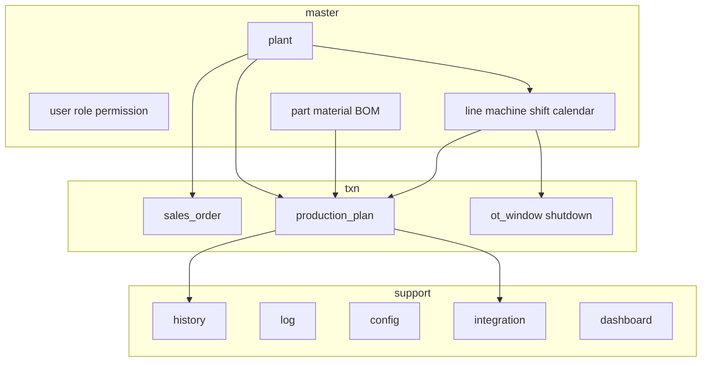
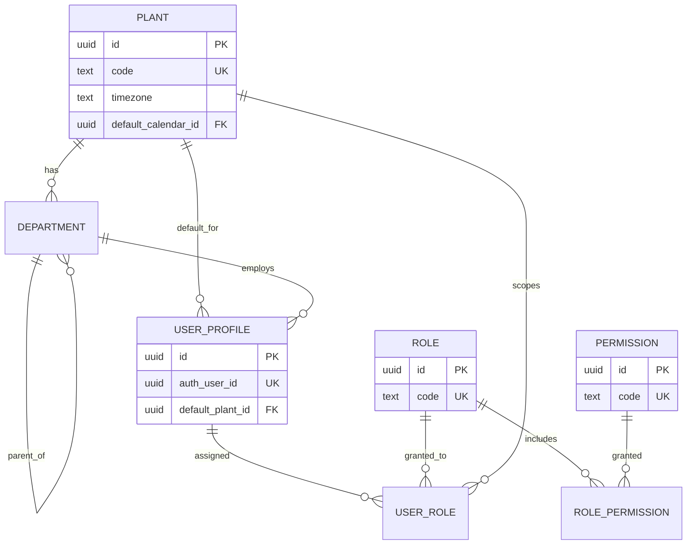
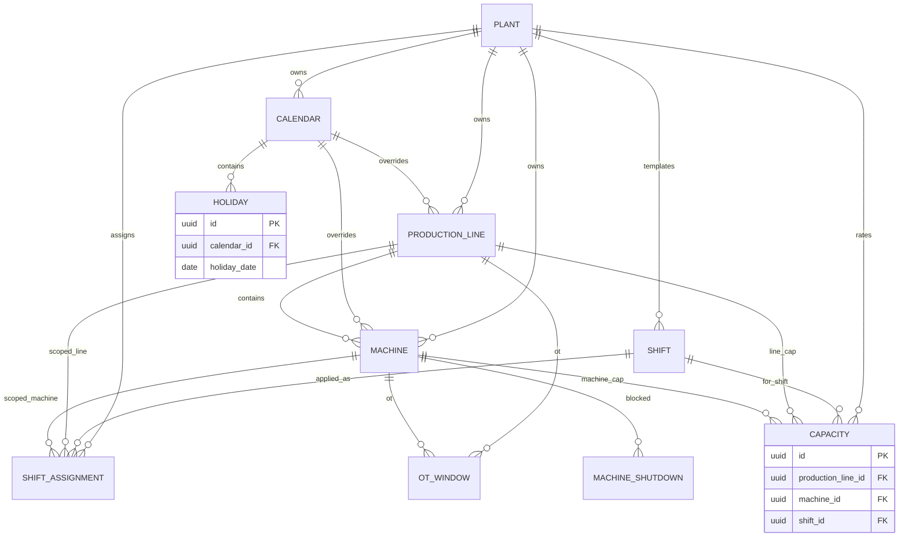
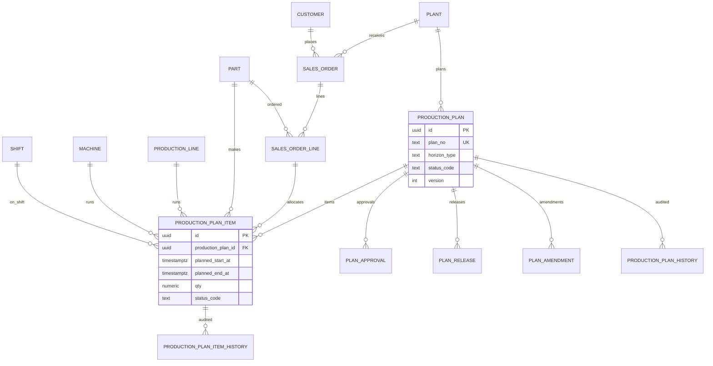
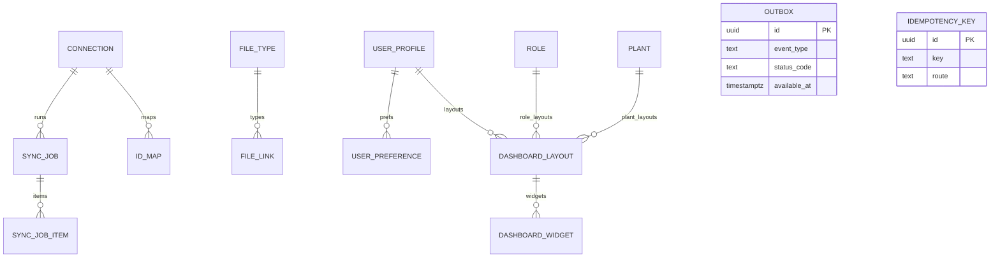

<!-- Canonical path: knowledge/ — legacy /docs retained as archive -->

# 06 — ER Diagram (Complete)

**Product:** Smart-Factory Manufacturing Platform  
**Audit\* columns omitted** — see [04](04_DATABASE_STANDARD.md) / [05](05_DATABASE_DICTIONARY.md)  
**Relationships matrix:** [37_TABLE_RELATIONSHIPS.md](37_TABLE_RELATIONSHIPS.md)

---

## 1. Platform overview



---

## 2. Organization & RBAC



---

## 3. Product masters (BOM + routing)

```mermaid
erDiagram
  PLANT ||--o{ CUSTOMER : hosts
  PLANT ||--o{ PART : owns
  PLANT ||--o{ MATERIAL : owns
  CUSTOMER ||--o{ PART : specifies
  UOM ||--o{ PART : measures
  UOM ||--o{ MATERIAL : measures
  UOM ||--o{ UOM_CONVERSION : from
  UOM ||--o{ UOM_CONVERSION : to
  PART ||--o{ PART_MATERIAL : bom_parent
  MATERIAL ||--o{ PART_MATERIAL : bom_child
  UOM ||--o{ PART_MATERIAL : bom_uom
  PART ||--o{ PART_PROCESS : routed
  PROCESS ||--o{ PART_PROCESS : step

  PART_MATERIAL {
    uuid id PK
    uuid part_id FK
    uuid material_id FK
    numeric qty_per
  }
  PART_PROCESS {
    uuid id PK
    uuid part_id FK
    uuid process_id FK
    int sequence
  }
```

---

## 4. Calendar, resources, capacity



**Rules**

- Capacity: XOR `production_line_id` / `machine_id`
- Calendar resolve: machine → line → `plant.default_calendar_id`

---

## 5. Planning transactions



---

## 6. Integration, config, dashboard



---

## 7. Cardinality notes

| Relationship | Cardinality |
|--------------|-------------|
| Plant → Lines | 1:N |
| Line → Machines | 1:N |
| Plan → Items | 1:N |
| Order → Lines | 1:N |
| Part → BOM rows | 1:N |
| Part ↔ Material | N:M via `part_material` |
| Role ↔ Permission | N:M via `role_permission` |
| User ↔ Role | N:M via `user_role` |
| Layout → Widgets | 1:N (CASCADE) |

---

## Related Documents

- [05_DATABASE_DICTIONARY.md](05_DATABASE_DICTIONARY.md)
- [37_TABLE_RELATIONSHIPS.md](37_TABLE_RELATIONSHIPS.md)
- [38_FOREIGN_KEYS.md](38_FOREIGN_KEYS.md)
