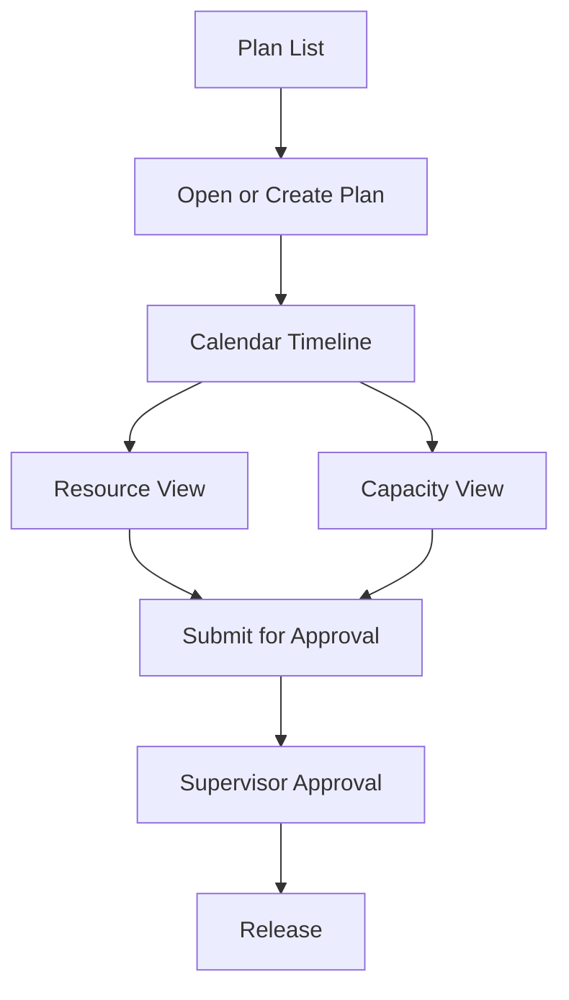

<!-- Canonical path: knowledge/ — legacy /docs retained as archive -->

# 28 — Screen Flow

**Product:** Smart-Factory Manufacturing Platform  
**Focus:** Production Planning (Phase 1)

---

## 1. Shell Screens

| Screen | Route (target) | Purpose |
|--------|----------------|---------|
| Login | `/login` | Supabase Auth |
| App Shell | `/(shell)/*` | Sidebar + top nav |
| Preferences | `/settings/preferences` | Theme, font, compact |
| Masters Admin | `/settings/masters/*` | Admin CRUD |

---

## 2. Planning Screens

| Screen | Route (target) | Purpose |
|--------|----------------|---------|
| Plan list | `/planning/plans` | Search plans by period/status |
| Plan calendar | `/planning/plans/[id]/calendar` | Google Calendar–style timeline |
| Plan resources | `/planning/plans/[id]/resources` | Resource lanes (line/machine) |
| Capacity | `/planning/plans/[id]/capacity` | Load vs capacity |
| Shift board | `/planning/plans/[id]/shifts` | Shift-oriented assignment |
| Approval | `/planning/approvals` | Inbox for submit/approve/reject |
| Release | `/planning/plans/[id]/release` | Release checklist |

---

## 3. Primary Planner Journey

---

## 4. Interaction Notes

### Drag & Drop

- Available on Calendar and Resource views
- On drop: optimistic UI → PATCH item with `version` → history write
- Conflict toast if holiday/shutdown/capacity violation

### Filters

- Date range, production line, machine, shift, status, customer/part search

### Mobile

- List + detail first; simplified timeline; drag optional via edit sheet

---

## 5. Future Screens (placeholders)

- Production job console
- Store movements
- OEE dashboards
- QC inspection forms
- Maintenance work orders

Do not implement until respective phases.

---

## Related Documents

- [09_UI_STANDARD.md](09_UI_STANDARD.md)
- [27_BUSINESS_FLOW.md](../10-business/27_BUSINESS_FLOW.md)
- [07_MODULES.md](../20-architecture/07_MODULES.md)
